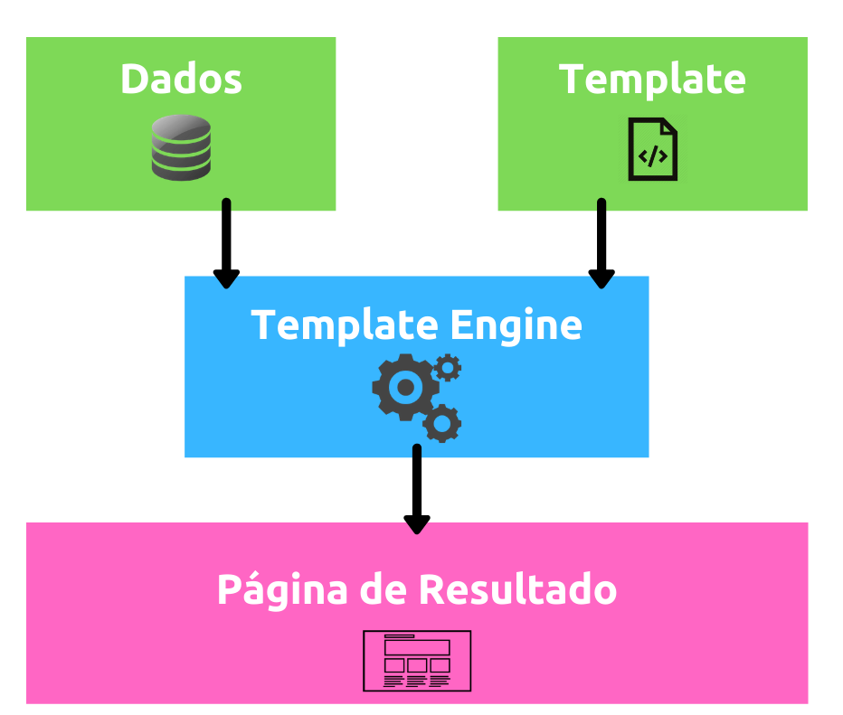

# O que é Template Engine?

Quando estamos desenvolvendo uma aplicação web, é comum que queiramos exibir determinados dados obtidos de alguma fonte (seja um banco de dados, uma API, uma lista, etc). Para essa exibição, normalmente utilizamos de páginas HTML para que sejam renderizadas no navegador.

Porém, a criação de páginas HTML é, muitas vezes, algo improdutivo e ineficiente, principalmente quando precisamos trabalhar com grandes quantidades de dados ou até utilizar recursos das linguagens de programação (for, if, case, etc) nas páginas HTML. Para estes casos, podemos utilizar as template engines (ou view engines).

Basicamente, uma template engine serve para facilitar a criação de páginas HTML e tornar o envio e exibição de informações para estas páginas um processo mais simples e organizado.

# Exemplo

Por padrão, o PHP possui uma forma de executar código em páginas HTML. Porém, este processo não é dos mais eficientes e legíveis do mercado. Imagine que você queira verificar se existe algum usuário logado na página e, caso positivo, exibir o nome deste usuário.

No PHP, este código ficaria da seguinte forma:

```
<?php if ($user->isLogged()): ?> 
Welcome back, <strong><?= $user->name; ?></strong> 
<?php endif; ?>

```

Utilizando uma template engine (como o Blade, template engine padrão do Laravel), este mesmo código poderia ser escrito da seguinte forma:

```
@if ($user->isLogged()) 
Welcome back, <strong>{{ $user->name }}</strong> 
@endif
```

É simples perceber a legibilidade de um código em comparação com o outro. Com o Blade, o uso de estruturas de condição é mais simples e legível, quando comparado ao PHP puro.

Algumas vantagens

Com o uso das template engines, conseguimos identificar diversas vantagens quando comparados ao uso de HTML puro:

- Maior velocidade na criação de templates;
- Melhor reaproveitamento de código HTML;
- Uso de tipos de dados nativos em páginas HTML;
- Uso de recursos das linguagens de programação em páginas HTML (estruturas de condição, repetição, etc), entre outros.

# Como funciona uma Template Engine?

Como sabemos, o navegador só consegue “ler” informações em HTML e renderizá-las para o usuário. Por isso, as template engines “traduzem” o conteúdo dos seus templates para código HTML puro os envia para o navegador. É este processo que permite que uma template engine exista, já que de nada adiantaria se as páginas retornadas por ela não pudessem ser lidas pelos navegadores.

Basicamente, o processo da criação de páginas pelas template engines se dá da seguinte forma:

Um template é criado (como o exemplo abaixo em Jinja2, um dos principais template engines do ecossistema Python):

```
<title></title>
<ul>

  <li><a href="{{ user.url }}">{{ user.username }}</a></li>

</ul>

```

Este template é “traduzido” para código HTML e enviado para o navegador.



# Principais template engines do mercado

No mercado existem diversos template engines. Os principais deles são:


## No PHP:

- Plates
- Blade
- Twig, entre outros

## No JavaScript:

- Mustache
- Handlebars
- doT
- EJS
- PUG
- Jade Language
- Squirrelly, entre outros.

## No Python::

- Django Template
- Genshi
- Jinja
- Mako, entre outros

## No Java:

- Java Server Pages (JSP);
- Thymeleaf;
- FreeMarker, entre outros.

# Então, podemos concluir…

O uso de template engines facilita a criação da camada de visualização de dados em uma aplicação. Com eles podemos utilizar recursos das linguagens de desenvolvimento para criar páginas HTML, como, estrutura de condição, de repetição, herança, etc.